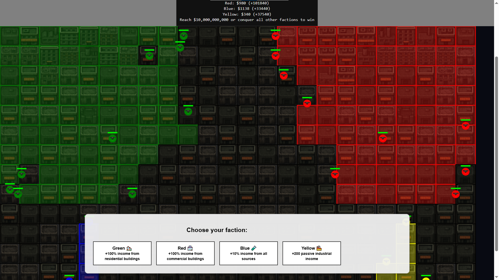

#Dystopia City

Gra przeglądarkowa o budowaniu futurystycznego miasta i walce o wpływy.

A browser-based game about building a futuristic city and fighting for dominance.

📸 Screenshot

🇵🇱 Opis gry (PL)

Dystopia City to gra osadzona w mrocznej, futurystycznej metropolii.
Gracz rozwija swoje miasto, buduje dzielnice, zarządza zasobami oraz zdobywa wpływy, rywalizując z innymi frakcjami o dominację nad cyber-miastem.

🔹 Cechy gry:

Budowa futurystycznych sektorów miasta

Zarządzanie zasobami i infrastrukturą

System wpływów i rywalizacji między frakcjami

Styl dystopijny: neon, mrok, cyberpunk

Prosta rozgrywka w przeglądarce (HTML5 + JavaScript)

🔹 Technologia:

JavaScript (jeden plik logiki gry)

HTML5 canvas (lub podstawowy DOM, zależnie od implementacji)

Lekki projekt działający w przeglądarce bez instalacji

🇬🇧 Game Description (EN)

Dystopia City is a browser game set in a dark, futuristic metropolis.
You expand your city, construct new districts, manage resources, and gain influence while competing with other factions for control over the cyber-city.

🔹 Features:

Construction of futuristic city sectors

Resource management and infrastructure planning

Influence and faction competition system

Dystopian atmosphere: neon, darkness, cyberpunk vibes

Runs directly in the browser (HTML5 + JavaScript)

🔹 Technology:

JavaScript (single main game file)

HTML5 / simple DOM-based rendering

Lightweight, no installation required

🧩 Informacje / About

Projekt powstał jako lekka gra eksperymentalna — połączenie city-buildera z prostą mechaniką wpływów frakcji w futurystycznym klimacie dystopii.

This project was created as a lightweight experimental game — mixing city-building mechanics with faction influence systems in a dystopian futuristic setting.
